# Capturas: las pantallas del juego desde su menú

Todas a 640x360, la resolución real del juego (en pantalla se escala con píxeles nítidos). Se regeneran con:

```bash
tools/capturas.sh          # usa build/; necesita xvfb-run en Linux
```

Los menús usan **iconos** (siluetas del atlas [`assets/ui/iconos.png`](../assets/ui/iconos.png), editable: ver [ESTILO_VISUAL.md](ESTILO_VISUAL.md#iconos)). El nombre de cada botón aparece, discreto, en la **leyenda de la base de la pantalla** al pasar el ratón (o el dedo) por encima, o al elegirlo con el teclado.

## Entrada

| | |
|---|---|
| 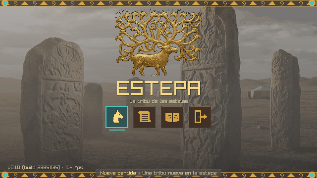 | **Título** (`--menu`): nueva partida, cargar, instructivo, salir. |
| 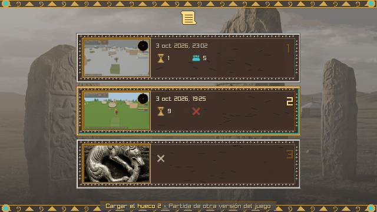 | **Cargar partida** (`--huecos`): tres huecos con minifoto, fecha, día y tribu. |
| 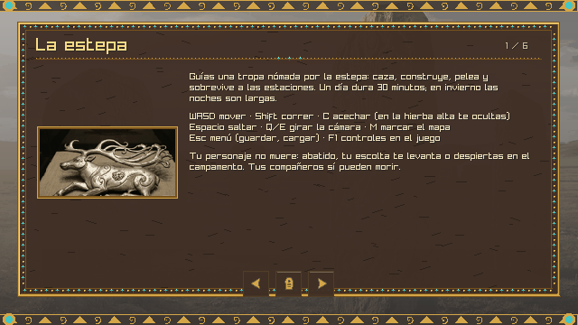 | **Instructivo** (`--instructivo`): láminas con las reglas; botones de página anterior, volver y siguiente. |

## En la partida

| | |
|---|---|
| 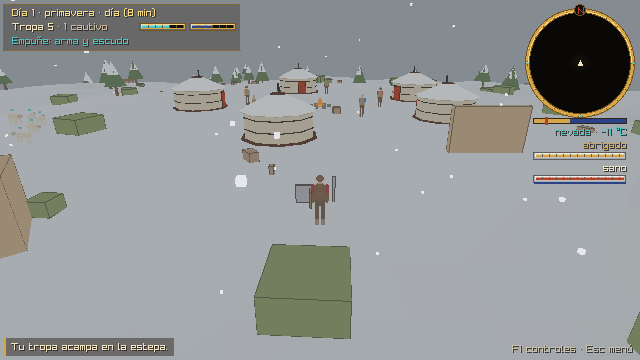 | **El juego**: HUD compacto, brújula, clima y salud. |
| 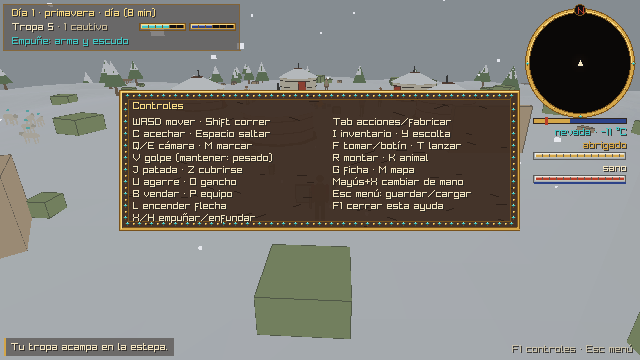 | **Controles** (F1, `--controles`). |
| 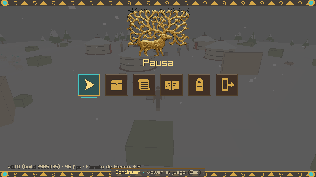 | **Pausa** (Esc, `--pausa`): continuar, guardar, cargar, instructivo, al título, salir. |
| 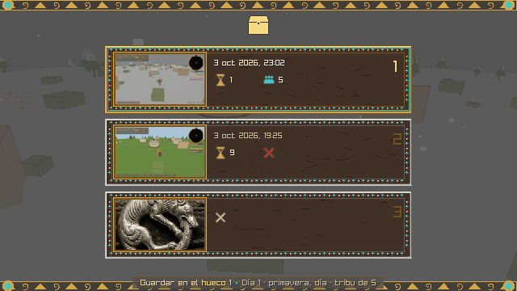 | **Guardar** (`--guardar`): la minifoto es la partida al pausar. |

## Menú Tab: acciones, obras, fabricar, reparar

| | |
|---|---|
| 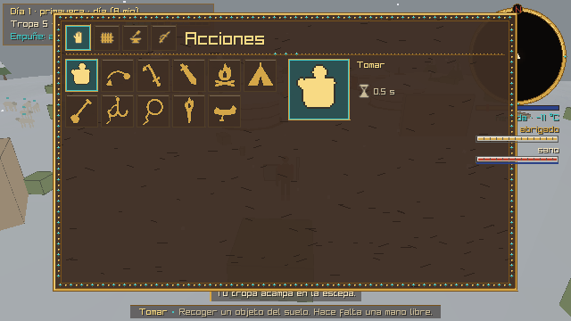 | **Acciones** (`--pestana 0`). |
| 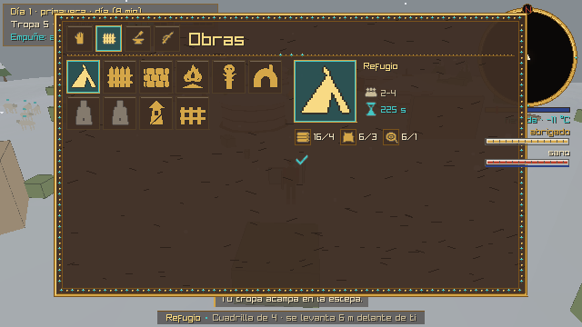 | **Obras en grupo** (`--pestana 1`): las grises no se pueden aún (falta oficio o cuadrilla). |
| 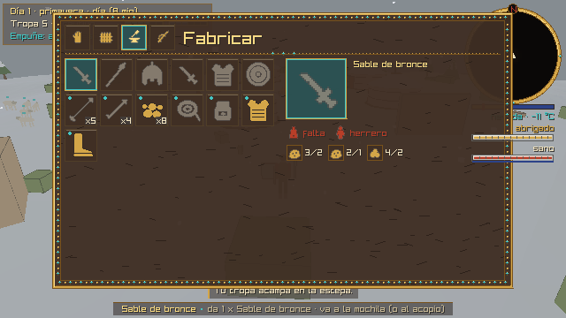 | **Fabricar** (`--pestana 2`): punto turquesa = a mano; los ingredientes, como iconos con lo que tienes / lo que hace falta. |
| 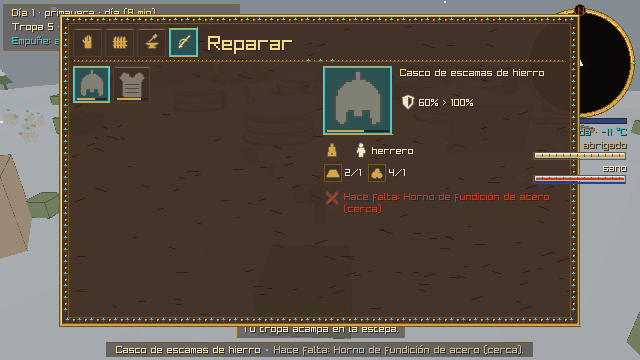 | **Reparar** (`--pestana 3`): la barra al pie es el estado de la pieza. |

## Inventario y equipo

| | |
|---|---|
| 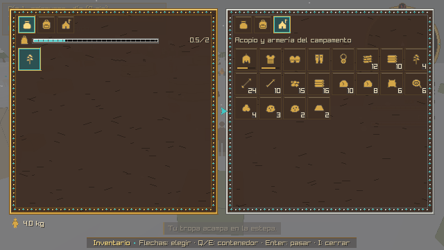 | **Inventario** (I, `--inventario`): dos columnas; arriba, los contenedores a mano (bolsillos, mochila, alforjas, carreta, campamento). |
| 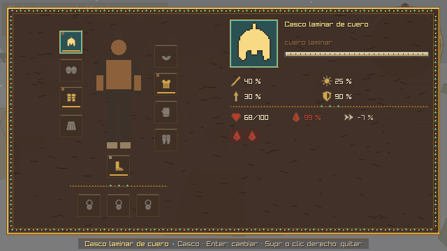 | **Equipo** (P, `--equipo`): los nueve huecos de armadura alrededor de la figura y los tres amuletos; a la derecha, sus cifras y la salud. |

## Combate y mundo

| | |
|---|---|
| 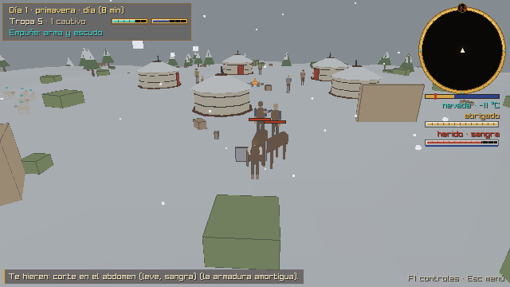 | **Jinetes bandidos** (`--enemigos jinetes`). |
| 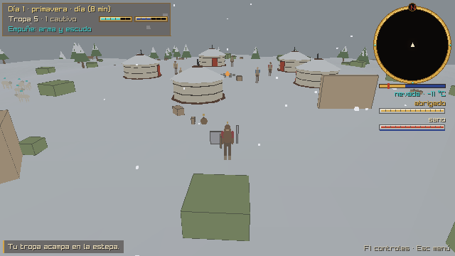 | **Bolsas de botín** (`--botin`). |
| 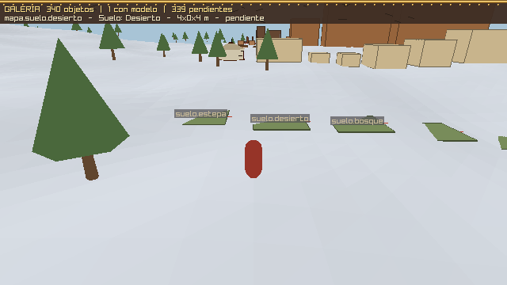 | **Galería de modelos** (`--galeria`): todos los objetos del inventario a escala. |
