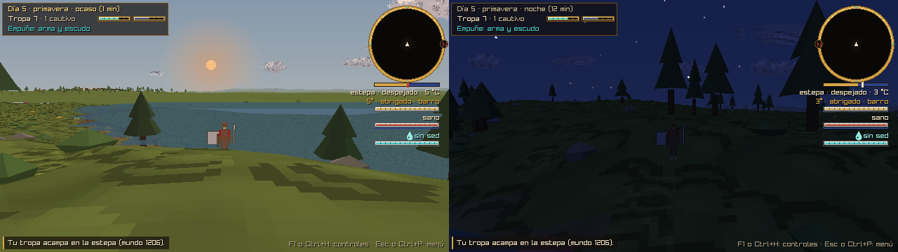
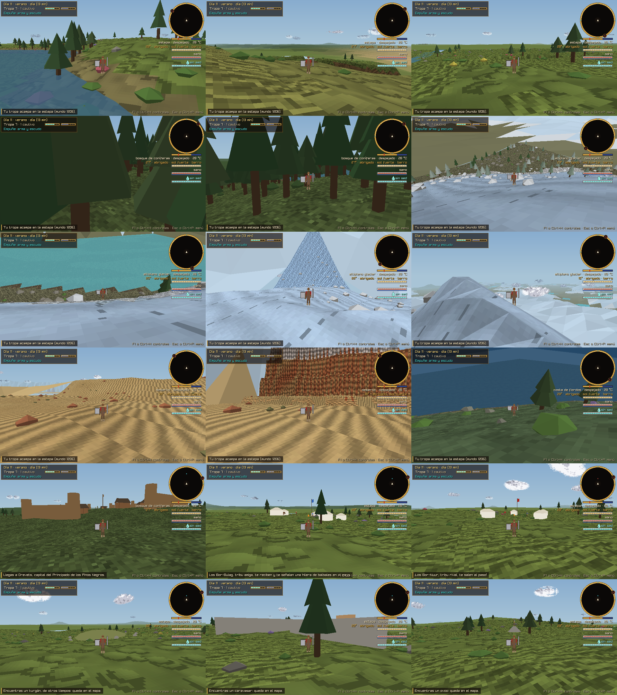

# El mundo: reglas fijas y detalles al azar

El mundo es una **gran tierra casi redonda** de 4,8 km de radio medio. Su borde es **fractal**: tiene entrantes y salientes, no es una circunferencia neta. Cada partida nueva tira una **semilla**. Las reglas de abajo no cambian nunca; la semilla solo mueve los detalles. Todo sale de `src/sim/world.c` (C puro): la altura y el agua son funciones de (x, z) que consultan el terreno, la física, la fauna y los mapas.

El norte es −Z y el este +X.


*Seis mundos (semillas 1206, 7, 42, 1984, 2024 y 31337) generados con las mismas reglas.*

## Reglas fijas

| Regla | Qué hace |
|---|---|
| **La estepa en el centro** | Allí acampa la tribu. La rodean **ríos de meandros** (trayecto tortuoso) que la separan de las demás regiones. |
| **Cuatro regiones alrededor** | **Noroeste:** bosque de coníferas muy tupido, con alerces que se doran en otoño. **Noreste:** desierto. **Sureste:** altiplano glaciar. **Suroeste:** costa de fiordos. |
| **Altitud media por región** | Costa ~12 m · desierto ~28 m · estepa ~40 m · bosque ~55 m · altiplano ~70 m. Encima va el relieve propio de cada una: matas y colinas suaves en la estepa, lomas en el bosque, crestas afiladas y cumbres nevadas en el altiplano, costa abrupta en los fiordos, dunas y mesetas en el desierto. |
| **El borde de los fiordos** | La tierra baja al **mar** (nivel 0). Los fiordos entran tierra adentro. |
| **El borde del desierto** | Un **gran cañón** y, detrás, un **muro de siete estratos** de 160 m. |
| **El borde del altiplano** | Un **muro de hielo glaciar** de 135 m, con grietas. Del altiplano bajan **ríos trenzados** por anchos lechos de grava; sus lagos son turquesa, de deshielo. |
| **El borde del bosque** | Un **canal sigmoideo** (serpentea) de 60 m de ancho, del que salen **ríos tributarios** hacia adentro. |
| **La frontera invisible** | Sigue el borde fractal, antes del mar abierto, del muro, del hielo o del canal. Un aviso explica por qué no se pasa. |
| **El agua corre hacia abajo** | El nivel de cada río baja siempre y su agua nunca queda sobre la orilla. Hay un lago siempre cerca del campamento. El desierto solo tiene oasis. |
| **Cada región, su gente y sus fieras** | **Gente:** un reino vecino por región, con su capital amurallada y tres aldeas al estilo de la región. **Fieras:** guaridas de las especies de la región. La fauna que aparece es la del hábitat de la región. |
| **Tribus nómadas** | Tres o cuatro por región (16 por mundo), con las tres actitudes en cada una: **rivales**, que salen al paso con jinetes o bandidos (de nuevo si te alejas 600 m y vuelves); **neutrales**, que observan; y **amigables**, que marcan en el mapa una estructura cercana que no viste. Sus campamentos de yurtas llevan un estandarte del color de su actitud: rojo, crudo o azul. |
| **Estructuras** | Unas 45 por mundo, según la región. Al verlas quedan en el mapa. Las ruinas son kurganes, balbales, piedras de ciervos, fortalezas derruidas, ciudades enterradas y petroglifos. En uso están los caravasares, torres de vigía, ovoos, pozos y embarcaderos. Reparto por región: estepa (kurganes, balbales, piedras de ciervos, ovoos, pozos, caravasar); bosque (fortalezas, torres, petroglifos); altiplano (ovoos, piedras de ciervos, petroglifos); costa (embarcaderos, túmulos); desierto (ciudades enterradas, caravasares, pozos). |
| **Reinos** | Estepa: **Kanato de Hierro** (al que la tribu rinde tributo). Bosque: **Principado de los Pinos Negros**. Altiplano: **Señorío del Glaciar**. Costa: **Jarlazgo de la Costa Helada**. Desierto: **Reino de los Oasis**. |

## Lo que cambia con cada semilla

- **El borde:** el contorno fractal de la tierra.
- **Fronteras entre regiones:** el radio de la estepa varía con ruido y las fronteras entre cuadrantes se tuercen. Ninguna región sale de su cuadrante.
- **Ríos:**
  - los meandros de la estepa: cuánto serpentean y su largo de onda;
  - cuántos tributarios salen del canal (4 a 6) y dónde;
  - los ríos trenzados del altiplano (3 a 4) y de los fiordos (1 a 2): su trazado y sus canales;
  - 14 a 20 **arroyos** de 2 a 3,5 m que bajan de lomas, bosques, cumbres y costa hasta el río más cercano.
- **Lagos:** 14 a 19, más 3 a 4 oasis; dónde están, su tamaño y la forma de su orilla.
- **Montañas:** dónde se levantan los macizos y cuánto miden.
  - En el altiplano, 8 a 12, con cumbres que llegan a las nubes.
  - En la costa, 5 a 8.
  - En el bosque, 4 a 6.
  - En la estepa, 2 a 3 lomas.
- **Pueblos y guaridas:** dónde caen, siempre dentro de su región, en seco y en llano.
  - Los pueblos quedan separados entre sí y lejos del campamento.
  - Las guaridas quedan lejos de los pueblos.
- **Nombres de los pueblos:** se arman con sílabas de cada región, sin repetirse.
- **Tribus y estructuras:** dónde caen y qué actitud tiene cada tribu (siempre de las tres en cada región).

## El suelo, el horizonte y el cielo

- **Texturas del suelo** (`src/world/terrain.c`): un atlas low-res de 4×4 celdas de 32 px, `assets/terrain/texturas.png`. Cada celda cubre 8 m de suelo. Están inspiradas en fotos de la estepa y del Altai:
  - matas y pasto alto de la estepa;
  - suelo del bosque, tundra del altiplano y musgo de la costa;
  - arena con ondas, estratos, grava de los ríos trenzados, nieve de glaciar, roca, barro cuarteado de las orillas y muro de hielo.

  La celda lleva luces y sombras en grises; la región y la estación ponen el color. En las paredes la textura va de pie, para que los estratos queden horizontales. El atlas se rehace con `python3 tools/assets/texturas_terreno.py generar --forzar`; `guia` dibuja la guía con los nombres.
- **Rocas y matas:** se generan por chunk, siempre iguales en cada sitio.
  - **Rocas facetadas:** pedreros en el altiplano y la costa, cantos rojizos en el desierto, con nieve encima en invierno.
  - **Matas y arbustos:** en la estepa (más junto al agua), sotobosque y saxaul; nunca en el glaciar.
  - **Flores** de la estepa en primavera.
  - **Bosque** más tupido y sotos junto a ríos y oasis.
- **Horizonte lejano:** una malla gruesa, de una celda por chunk, que llega a ~2,4 km bajo los chunks cargados. Deja un hueco donde están los chunks. Así se ven a lo lejos las montañas, los muros, el hielo y el mar. Lo lejano se pierde en una bruma del color del horizonte.
- **Cielo** (`src/world/sky.c`):
  - un degradado del cenit al horizonte;
  - el **sol** sale por el este, pasa por el sur a mediodía y se pone por el oeste, con un resplandor cálido cuando está bajo;
  - la **luna** recorre el mismo arco, retrasada según su fase (una luna cada 14 días: nueva junto al sol, llena opuesta);
  - las **estrellas** giran alrededor del polo norte.
- **Nubes** (`src/world/clouds.c`):
  - una capa a altura fija, 80 m sobre el llano del campamento;
  - cada nube es un racimo de carteles pixelados del atlas `assets/sky/nubes.png`, sacado de fotografías de nubes reales con `tools/assets/nubes.py`:
    - cúmulos con buen tiempo;
    - estratos y cielo cubierto con más nubes;
    - nubarrones con tormenta;
  - el viento la arrastra, y cuántas nubes hay sale de la cobertura del clima;
  - las cumbres altas del altiplano atraviesan la capa y llevan además su gorro de nubes;
  - con la cámara dentro de una nube, la vista se cubre de niebla.



*El ocaso al oeste y la luna creciente al este, de noche.*

## Parámetros para afinar

Están todos en `src/sim/world.c`, salvo donde se indica otro archivo.

| Parámetro | Dónde | Efecto |
|---|---|---|
| `WORLD_RADIUS` | `world.h` | Radio medio de la tierra. |
| `world_edge_radius()` | borde | Lo fractal del borde: amplitud y octavas del ruido. |
| `STEPPE_R` y su ruido | arriba | Radio de la estepa central. |
| `SECTOR_ANGLE[]`, `SECTOR_HALF`, `SECTOR_BLEND` | arriba | El cuadrante de cada región y la transición entre ellas. |
| `ALTITUDE[]` | arriba | Altitud media de cada región. |
| `region_detail()` | relieve | Relieve propio de cada región. |
| `PEAK_RULES[]` | `world_generate` | Montañas por región: cuántas, alturas y radios. |
| `CANAL_E`, `CANAL_SWING`, `CANAL_HALF`, `CANAL_DEPTH` | arriba | El canal sigmoideo del bosque. |
| `SHORE_E`, `fjord_inlet()` | arriba | La costa y lo que entran los fiordos. |
| `WALL_E`, `GORGE_E` | arriba | El cañón y el muro de estratos del desierto. |
| `ICE_E` | arriba | El muro de hielo del altiplano. |
| `make_meanders()`, `make_radial()` | `world_generate` | Meandros, tributarios y ríos trenzados. |
| Lagos 14–19, oasis 3–4 | `world_generate` | Lagos y oasis. |
| `tree_density()` | `src/world/terrain.c` | Árboles por región (bosque tupido: 0,62). |
| `ground_color()`, `ground_tex()` | `src/world/terrain.c` | Color y textura del suelo. |
| `FAR_CELLS`, `FAR_HAZE_NEAR` | `src/world/terrain.c` | Alcance del horizonte lejano y su bruma. |
| `SKY_LUNAR_DAYS`, `arc_dir()` | `src/world/sky.*` | Fases de la luna y arco del sol. |
| `CLOUD_ABOVE_PLAIN`, `CLOUD_VIEW`, `CELL` | `src/world/clouds.*` | Altura de las nubes, alcance y tamaño de la celda de cada nube. |

## Cómo verlo

```bash
./build/estepa --semilla 42 --mapa-mundo mapa.png         # mapa general (1024 px; --mapa-tam N cambia el tamaño)
./build/estepa --semilla 42 --orbital 30 0.5              # vista orbital: grados alrededor e inclinación (0 de canto, 1 desde arriba)
./build/estepa --semilla 42 --ir muro --dia 11 --minuto 7 # a pie de un sitio (ver la lista abajo)
./build/estepa --ir estepa --dia 5 --minuto 18 --camara 0.06 --rumbo 90   # la luna al este, de noche
```

Sitios de `--ir`:
- **Regiones y paisaje:** estepa, meandro, arroyo, bosque, canal, altiplano, trenzado, hielo, cumbre, fiordos, mar, desierto y muro.
- **Pueblos y fieras:** capital, aldea y guarida.
- **Tribus:** tribu (amiga), rival y neutral.
- **Estructuras:** kurgan, balbales, piedra, fortaleza, ciudad, petroglifos, caravasar, torre, ovoo, pozo y embarcadero.

`--camara` fija la inclinación: 0,05 es casi de canto, con el cielo a la vista; 1,25 es desde arriba. `--rumbo` fija los grados: 0 sur, 90 este, 180 norte, 270 oeste.

En el juego, **F5** abre la vista orbital (flechas: girar e inclinar).

### Mapas generales

| | |
|---|---|
|  |  |
|  |  |

### Vista orbital


### A pie



*Estepa, meandro, arroyo · bosque, canal, altiplano · río trenzado, muro de hielo, cumbre entre las nubes · desierto, muro de estratos, mar · capital del bosque, tribu amiga, tribu rival · kurgán, caravasar, ovoo.*
