# El mundo: reglas fijas y detalles al azar

El mundo es un **gran círculo** de 2,4 km de radio. Cada partida nueva tira una **semilla**. Las reglas de abajo no cambian nunca; la semilla solo mueve los detalles. Todo sale de `src/sim/world.c` (C puro): la altura y el agua son funciones de (x, z) que consultan el terreno, la física, la fauna y los mapas.

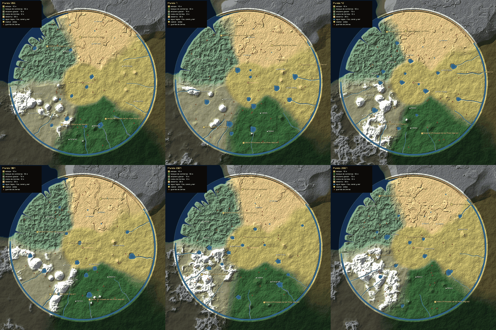

*Seis mundos (semillas 1206, 7, 42, 1984, 2024 y 31337) generados con las mismas reglas.*

## Reglas fijas

| Regla | Qué hace |
|---|---|
| **Cinco regiones en sectores** | La estepa ocupa el centro (allí acampa la tribu) y un sector hasta el borde. Alrededor, siempre en este orden: bosque de coníferas, altiplano glaciar, costa de fiordos y desierto. |
| **Altitud media por región** | Costa ~12 m · desierto ~28 m · estepa ~40 m · bosque ~55 m · altiplano ~70 m. Encima va el relieve propio de cada una: colinas suaves en la estepa, lomas en el bosque, meseta y cordilleras en el altiplano, costa abrupta en los fiordos, dunas y mesetas de borde cortado en el desierto. |
| **El borde de la costa** | La tierra baja al **mar** (nivel 0). Fiordos estrechos entran hasta 500 m tierra adentro. |
| **El borde del desierto** | Un **cañón** de 30 m de hondo y, detrás, un **muro** de seis estratos que sube 140 m. |
| **El borde del resto** | Estepa, bosque y altiplano terminan en el **gran canal**, un cauce de 52 m de ancho. De él salen entre 6 y 9 **ríos tributarios** hacia el centro. |
| **La frontera invisible** | A 2.330 m del centro nadie pasa. Un aviso explica por qué: el mar, el muro o el canal. |
| **El agua corre hacia el canal** | Los ríos bajan desde el interior y su agua nunca queda sobre la orilla. Algunos acaban en un lago. Hay un lago siempre cerca del campamento. El desierto solo tiene oasis. |
| **Cada región, su gente y sus fieras** | **Gente:** un reino vecino por región, con su capital amurallada y dos aldeas al estilo de la región. **Fieras:** guaridas de las especies de la región. La fauna que aparece es la del hábitat de la región. |
| **Reinos** | Estepa: **Kanato de Hierro** (al que la tribu rinde tributo). Bosque: **Principado de los Pinos Negros**. Altiplano: **Señorío del Glaciar**. Costa: **Jarlazgo de la Costa Helada**. Desierto: **Reino de los Oasis**. |

## Lo que cambia con cada semilla

- **Fronteras entre regiones:** se tuercen con ruido y el conjunto gira hasta ±5°. Ninguna región sale de su sector.
- **Ríos:** cuántos son, dónde nacen en el canal, cuánto serpentean y hasta dónde llegan.
- **Lagos:** cuántos son, dónde están, su tamaño y la forma de su orilla. Algunos aparecen al final de un río.
- **Montañas:** dónde se levantan los macizos y cuánto miden.
  - En el altiplano, 4 a 7, con cumbres nevadas.
  - En la costa, 3 a 5.
  - En el bosque, 2 a 4.
  - En la estepa, 1 a 3 lomas.
- **Pueblos y guaridas:** dónde caen, siempre dentro de su región, en seco y en llano.
  - Los pueblos quedan separados entre sí y lejos del campamento.
  - Las guaridas quedan lejos de los pueblos.
- **Nombres de los pueblos:** se arman con sílabas de cada región, sin repetirse.

## Parámetros para afinar

Están todos en `src/sim/world.c`, salvo donde se indica otro archivo.

| Parámetro | Dónde | Efecto |
|---|---|---|
| `WORLD_RADIUS`, `WORLD_LIMIT` | `world.h` | Tamaño del círculo y frontera invisible. |
| `ALTITUDE[]` | arriba | Altitud media de cada región. |
| `SECTOR_ANGLE[]`, `SECTOR_HALF`, `SECTOR_BLEND` | arriba | Dónde está cada región, el ancho de su sector y la transición entre regiones. |
| `0.24R–0.34R` | `world_region_weights` | Radio de la estepa central. |
| `region_detail()` | relieve | Relieve propio de cada región: amplitud de colinas, cordilleras, dunas y mesetas. |
| `PEAK_RULES[]` | `world_generate` | Montañas por región: cuántas, alturas y radios. |
| `CANAL_E`, `CANAL_HALF`, `CANAL_DEPTH` | arriba | El gran canal. |
| `SHORE_E`, `fjord_inlet()` | arriba | La costa y lo que entran los fiordos. |
| `WALL_E`, `GORGE_E` y la altura del muro (140) | arriba y `land()` | El cañón y el muro del desierto. |
| `6 + rng_range(4)` ríos, ancho 5–10 m | `world_generate` | Ríos tributarios. |
| `7 + rng_range(5)` lagos, radio 30–75 m | `world_generate` | Lagos. |
| Oasis 2–3, radio 12–20 m | `world_generate` | Oasis del desierto. |
| 3 pueblos por región, 380 m entre ellos | `world_generate` | Pueblos. |
| 5–7 guaridas por región, `den_species()` | `world_generate` | Guaridas y sus especies. |
| `tree_density()` | `src/world/terrain.c` | Árboles por región. |
| `ground_color()` | `src/world/terrain.c` | Colores del suelo por región. |

## Cómo verlo

```bash
./build/estepa --semilla 42 --mapa-mundo mapa.png        # mapa general (1024 px; --mapa-tam N cambia el tamaño)
./build/estepa --semilla 42 --orbital 30 0.5             # vista orbital: grados alrededor e inclinación (0 de canto, 1 desde arriba)
./build/estepa --semilla 42 --ir muro --dia 11 --minuto 7 # a pie de un sitio: estepa, bosque, altiplano, fiordos, desierto,
                                                         # canal, muro, mar, capital, aldea, guarida
```

En el juego, **F5** abre la vista orbital (flechas: girar e inclinar).

### Mapas generales

| | |
|---|---|
| 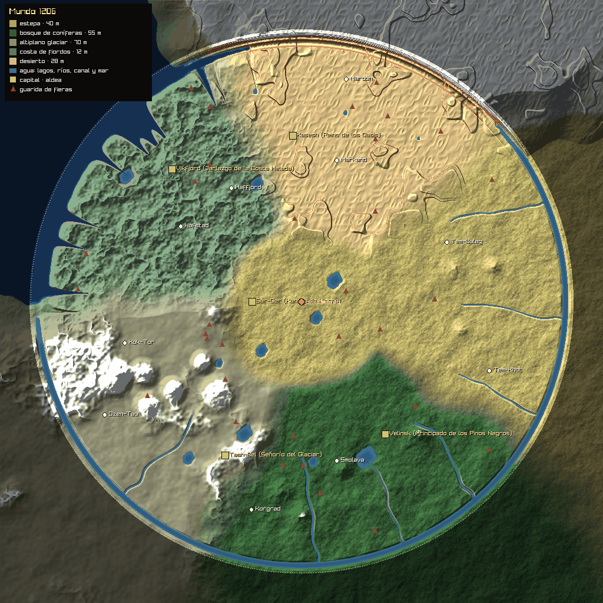 | 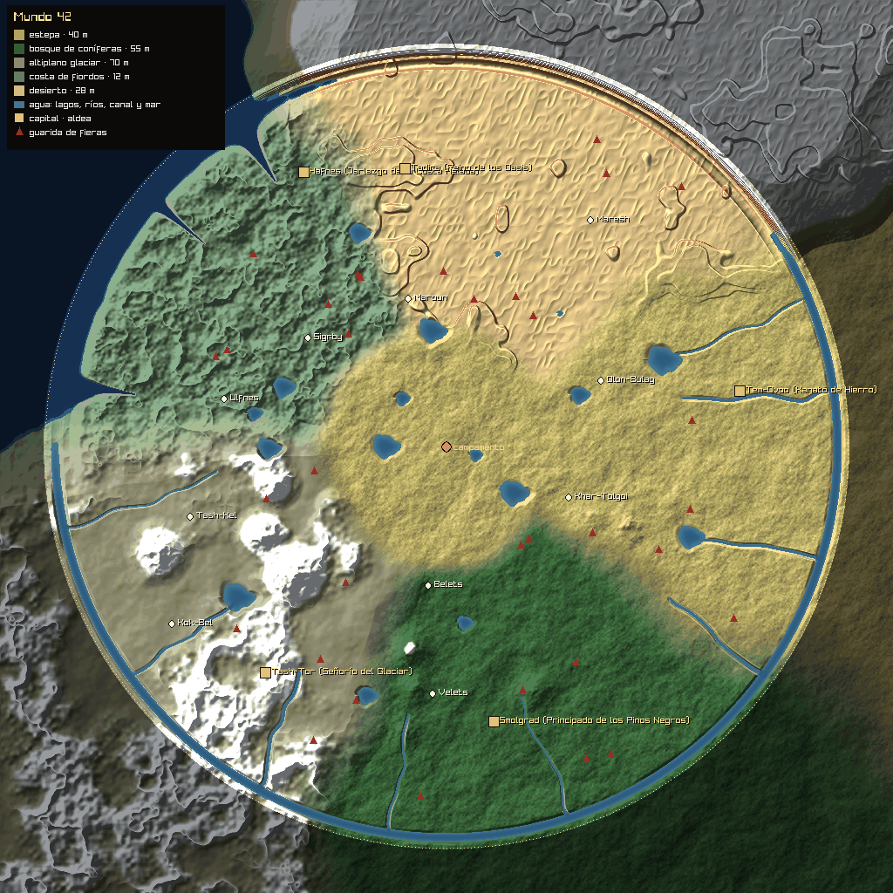 |
| 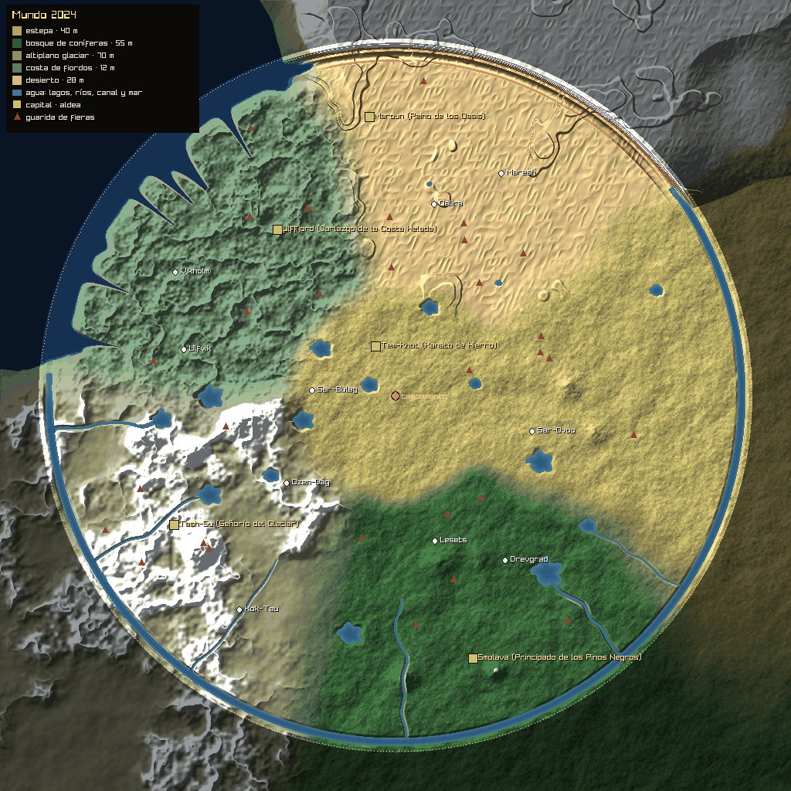 | 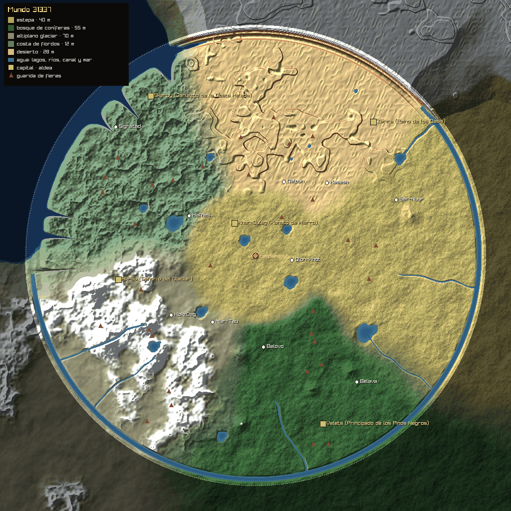 |

### Vista orbital

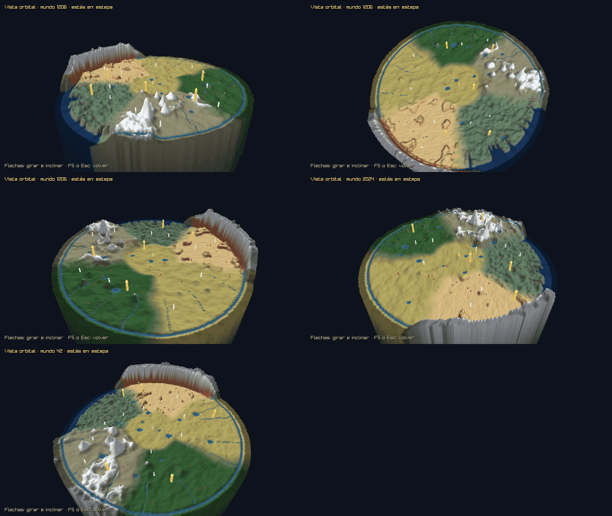

### A pie

| | | |
|---|---|---|
| 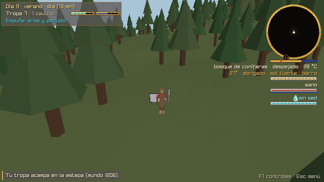 | 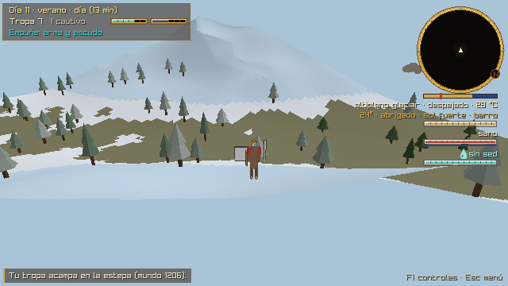 | 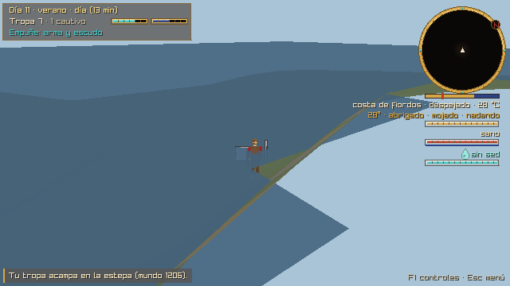 |
| 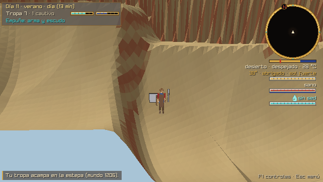 | 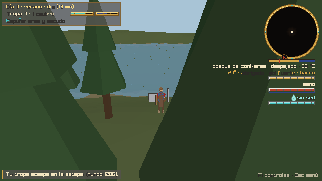 | 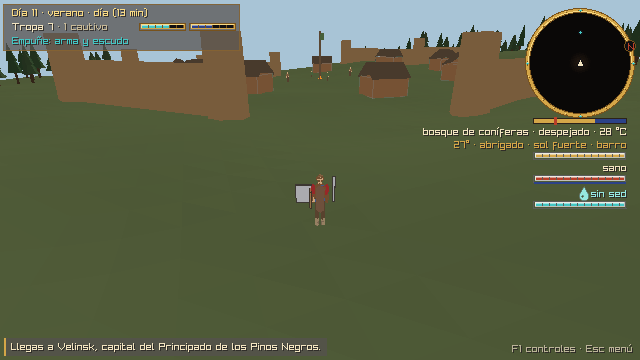 |
| 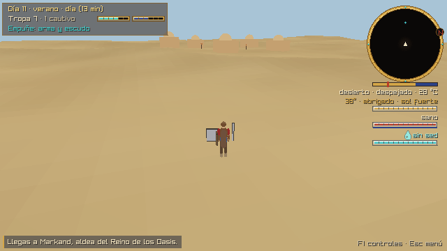 | 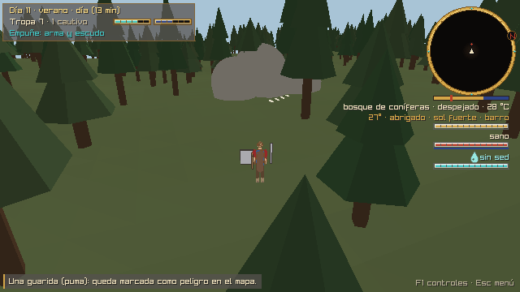 | 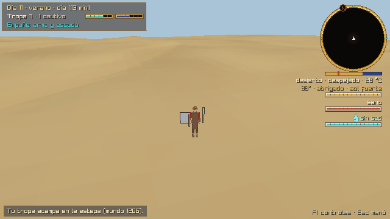 |
